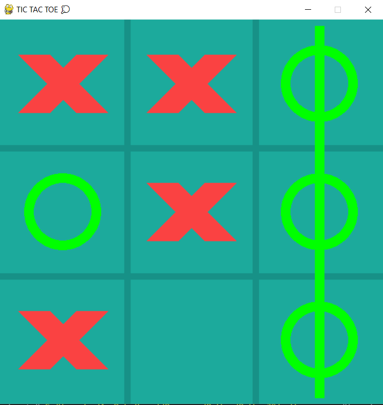

# Python
## GAME
- game2DVoice is a game that uses sound to play.

- Mario-Level-1 `Endter` to start `⬅` to turn left `➡` turn right `a` to jump
  - credit Mario-Level-1 : https://github.com/justinmeister/Mario-Level-1

- rock_paper_scissors

- Tic Tac Toe (XO)
> for 2 player
> credit : https://www.youtube.com/watch?v=pc7XhHxSgrM

## CODEING
- siri is a python that uses the principle from speechrecognition
